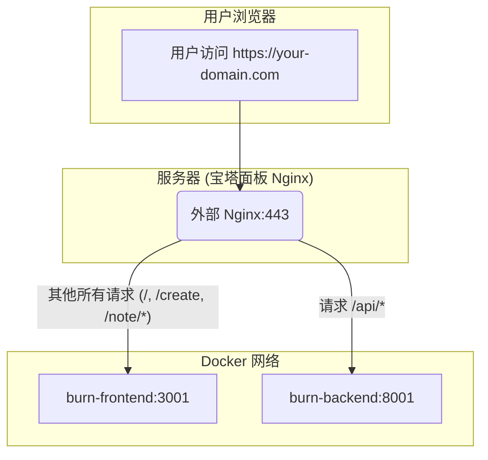

# Burn After Reading - 生产环境部署指南 (v2.0)

本文档提供了在 **Debian 12** 服务器上，特别是集成了 **宝塔面板 (BT Panel)** 的环境中，从零开始部署 "Burn After Reading" 应用的详细步骤和关键注意事项。

---

## 目录
1.  [核心架构](#1-核心架构)
2.  [环境要求](#2-环境要求)
3.  [一键部署流程](#3-一键部署流程)
4.  [部署后验证](#4-部署后验证)
5.  [关键"陷阱"与排错详解](#5-关键陷阱与排错详解)
    -   [5.1 陷阱一：系统 Docker vs 官方 Docker CE](#51-陷阱一系统-docker-vs-官方-docker-ce)
    -   [5.2 陷阱二：宝塔面板的"隐形" Nginx](#52-陷阱二宝塔面板的隐形-nginx)
    -   [5.3 陷阱三：前端构建环境变量注入失败](#53-陷阱三前端构建环境变量注入失败)
    -   [5.4 陷阱四：API 路由与健康检查的一致性](#54-陷阱四api-路由与健康检查的一致性)
    -   [5.5 陷阱五：后端响应模型验证失败 (ResponseValidationError)](#55-陷阱五后端响应模型验证失败-responsevalidationerror)
    -   [5.6 陷阱六：前后端数据定义不匹配 (422 Unprocessable Entity)](#56-陷阱六前后端数据定义不匹配-422-unprocessable-entity)
    -   [5.7 陷阱七：业务逻辑与数据模型不一致 (500 Internal Server Error)](#57-陷阱七业务逻辑与数据模型不一致-500-internal-server-error)
    -   [5.8 陷阱八：HTTP头部中文编码失败 (UnicodeEncodeError)](#58-陷阱八http头部中文编码失败-unicodeencodeerror)
6.  [手动维护命令](#6-手动维护命令)

---

## 1. 核心架构

本项目采用基于 Docker Compose 的容器化架构，由三个核心服务和一个外部反向代理组成：

-   **`burn-backend`**: FastAPI 后端服务，处理所有 API 请求、数据库交互和文件存储。
-   **`burn-frontend`**: 基于 Nginx 的前端服务，负责提供编译后的 Vue.js 静态文件。
-   **`burn-db`**: (如果使用) PostgreSQL 数据库服务。当前部署脚本使用 SQLite，此服务不启用。
-   **外部 Nginx (宝塔面板)**: 作为流量入口，负责处理 SSL/TLS 加密，并作为反向代理，根据 URL 路径将请求分发给前端或后端容器。

**流量走向图:**


---

## 2. 环境要求

-   **操作系统**: Debian 12 (Bookworm)
-   **服务器面板**: 已安装宝塔面板 (BT Panel) - 脚本已针对此环境进行适配。
-   **域名**: 一个已解析到您服务器 IP 的域名。
-   **依赖**: `git`, `curl`, `sudo` (脚本会自动尝试安装)。
-   **Docker**: 脚本会自动卸载系统自带的 `docker.io` 并安装官方的 `docker-ce`。

---

## 3. 一键部署流程

项目提供了一个强大的自动化部署脚本 `scripts/deploy_server.sh`，它能处理几乎所有的部署任务。

1.  **克隆项目**:
    ```bash
    sudo apt update && sudo apt install -y git
    git clone https://github.com/lgnorant-lu/burn_after_reading.git /opt/burn_after_reading
    cd /opt/burn_after_reading
    ```

2.  **切换到部署分支**: (如果需要)
    ```bash
    git checkout feature/docker-deployment
    ```

3.  **赋予脚本执行权限**:
    ```bash
    chmod +x scripts/deploy_server.sh
    ```

4.  **执行部署脚本** (请使用 `sudo` 或以 `root` 用户身份运行):
    ```bash
    sudo bash scripts/deploy_server.sh your-domain.com
    ```
    将 `your-domain.com` 替换为您的真实域名。脚本会自动完成以下所有工作：
    -   检查并安装所有必要的依赖。
    -   正确地安装和配置 Docker 环境。
    -   从 GitHub 拉取最新的代码。
    -   创建生产环境配置文件 `.env.prod`。
    -   **自动适配宝塔环境**，在正确的位置生成 Nginx 配置文件。
    -   使用 Certbot 申请 SSL 证书并配置 HTTPS。
    -   使用 Docker Compose 构建并启动所有应用容器。
    -   清理旧的 Docker 镜像。

---

## 4. 部署后验证

脚本执行成功后，等待约一分钟让服务完全启动，然后：

1.  打开浏览器访问 `https://your-domain.com`。
2.  **功能烟雾测试**:
    -   尝试创建一条文本便签。
    -   访问生成的链接，确认可以查看并销毁。
    -   尝试上传一个小文件。
    -   访问生成的链接，确认可以下载。
3.  **查看实时日志**:
    ```bash
    cd /opt/burn_after_reading
    sudo docker-compose logs -f
    ```

---

## 5. 关键"陷阱"与排错详解

在部署过程中，我们遇到了一系列复杂的问题。这里详细记录下来，便于未来排错。

### 5.1 陷阱一：系统 Docker vs 官方 Docker CE

-   **问题描述**: 在 Debian 系统上使用 `apt install docker.io` 安装的 Docker 版本较旧，且与 AppArmor 配置文件存在兼容性问题，导致 `docker-compose up` 失败。
-   **解决方案**: `deploy_server.sh` 脚本现在会自动 **卸载** 包括 `docker.io`, `docker-compose`, `containerd` 在内的旧版本，然后添加 Docker **官方软件源**，并安装最新的 `docker-ce`, `docker-ce-cli` 等组件。这从根本上保证了 Docker 环境的稳定和纯净。

### 5.2 陷阱二：宝塔面板的"隐形" Nginx

-   **问题描述**: 宝塔面板会安装并管理自己独立的 Nginx 服务，其路径和启停命令与系统默认的 Nginx (`systemctl start nginx`) **完全不同**。如果在脚本中使用了错误的命令，会导致配置无法加载、服务无法启动、端口冲突等一系列诡异问题。
-   **宝塔 Nginx 路径**: `/www/server/nginx/`
-   **宝塔 Nginx 命令**: `/etc/init.d/nginx start|stop|reload|restart`
-   **解决方案**: `deploy_server.sh` 脚本通过检查 `/www/server/panel` 目录是否存在来 **自动检测宝塔环境**。一旦检测到，脚本会强制使用宝塔的专用路径和命令来配置和重载 Nginx，完美解决了环境不一致的问题。

### 5.3 陷阱三：前端构建环境变量注入失败

-   **问题描述**: 前端应用在创建 API 请求时，直接访问了后端的内网 IP (`http://127.0.0.1:8001`)，导致了致命的 CORS 跨域错误。这是因为前端在构建时，未能获取到正确的 API 路径。
-   **根本原因**: `frontend/Dockerfile` 中虽然接收了 `VITE_API_BASE_URL` 这个构建参数，但没有使用 `ARG` 和 `ENV` 指令将其声明为容器内的环境变量，导致 `npm run build` 命令无法访问该变量。
-   **解决方案**: 在 `frontend/Dockerfile` 的 `RUN npm run build` 命令之前，添加了以下两行，确保变量能够被正确注入：
    ```dockerfile
    ARG VITE_API_BASE_URL
    ENV VITE_API_BASE_URL=$VITE_API_BASE_URL
    ```

### 5.4 陷阱四：API 路由与健康检查的一致性

-   **问题描述**: 将所有后端路由统一添加 `/api` 前缀后，忘记了更新 `docker-compose.yml` 中的健康检查 (`healthcheck`) URL，导致后端容器虽然正常启动，但一直处于 `unhealthy` 状态，从而阻止了依赖它的前端容器启动。
-   **解决方案**: 确保项目中所有涉及到后端 URL 的地方都保持一致。
    -   **`src/main.py`**: 所有 `@api_router.get` / `@api_router.post` 都在 `/api` 路由下。
    -   **`scripts/deploy_server.sh`**: Nginx 配置中 `location /api/` 指向后端。
    -   **`docker-compose.yml`**: 后端的 `healthcheck` 指向 `http://localhost:8001/api/health`。
    -   **`frontend/Dockerfile`**: 构建参数 `VITE_API_BASE_URL` 设置为 `/api`。

### 5.5 陷阱五：后端响应模型验证失败 (ResponseValidationError)

-   **问题描述**: 成功创建/获取笔记后，后端返回 `500 Internal Server Error`。日志显示 `ResponseValidationError: ... 'type': 'missing', ... 'has_password'`。
-   **根本原因**: 后端从数据库取出的 `models.Note` 对象与用于生成响应的 Pydantic 模型 `schemas.NoteResponse` 结构不完全匹配。响应模型要求有一个 `has_password` 字段，但数据库模型中没有。
-   **解决方案**: 采用侵入性最小、最安全的修复方式。不去修改数据库模型（这会涉及复杂的数据库迁移），而是在 **返回数据前动态添加属性**。在 `src/main.py` 的所有相关接口（`create_text_note`, `upload_file`, `get_note_info`）中，在 `return db_note` 之前，都加入了以下逻辑：
    ```python
    # Manually set the has_password attribute before returning.
    note.has_password = note.password_hash is not None
    ```

### 5.6 陷阱六：前后端数据定义不匹配 (422 Unprocessable Entity)

-   **问题现象**: 在选择带有过期时间的选项（如"1小时后"）创建笔记或上传文件时，API 返回 `422` 错误。
-   **根本原因**: 前端发送的 `expiration_type` 值 (如 `"hours_1"`) 与后端 Pydantic 模型期望接收的值 (`"one_hour"`) 不匹配。这是一个典型的"前后端约定不一致"问题。
-   **解决方案**:
    1.  **启用详细日志**: 临时在后端 `main.py` 中添加一个自定义的 `RequestValidationError` 异常处理器，将详细的验证错误信息打印到日志中，从而精确定位到是哪个字段的哪个值出了问题。
    2.  **统一数据源**: 检查并修正 `frontend/src/services/api.ts` 中最源头的 `ExpirationType` 类型定义。
    3.  **修正组件**: 检查并修正所有使用到该类型的前端组件（如 `CreatePage.vue`）中的值，确保与后端完全一致。
    4.  **清理**: 问题解决后，移除后端的临时异常处理器。

### 5.7 陷阱七：业务逻辑与数据模型不一致 (500 Internal Server Error)

-   **问题现象**: 修复 `422` 问题后，带有过期时间的笔记在读取时依然被立即删除。
-   **根本原因**: 后端的业务逻辑代码与数据模型脱节。`src/utils.py` 中的 `calculate_expiration_time` 函数还在使用旧的枚举成员名（如 `ExpirationType.HOURS_1`），而 `src/models.py` 中的枚举定义已经更新为 `ExpirationType.ONE_HOUR`，导致 `AttributeError`。
-   **解决方案**: 深入检查并修正所有后端业务逻辑代码（如此处的 `utils.py`），确保其引用的数据模型成员与模型定义完全一致。

### 5.8 陷阱八：HTTP头部中文编码失败 (UnicodeEncodeError)

-   **问题现象**: 下载带有中文名的文件时，API 返回 `500` 错误。
-   **根本原因**: `main.py` 的 `download_file` 端点在构建 `Content-Disposition` HTTP头部时，直接将未经编码的中文文件名放入其中。HTTP头部标准（latin-1）不支持此操作，导致编码失败。
-   **解决方案**: 引入 `urllib.parse.quote`，并遵循 RFC 6266 规范，对文件名进行 UTF-8 编码，再放入HTTP头部。例如：`'Content-Disposition': f"attachment; filename*=UTF-8''{quote(filename)}"`。

---

## 6. 手动维护命令

-   **查看所有容器日志**: `cd /opt/burn_after_reading && sudo docker-compose logs -f`
-   **只看后端日志**: `sudo docker logs burn-backend`
-   **只看前端日志**: `sudo docker logs burn-frontend`
-   **停止所有服务**: `cd /opt/burn_after_reading && sudo docker-compose down`
-   **重启所有服务**: `cd /opt/burn_after_reading && sudo docker-compose up -d`
-   **重载宝塔 Nginx 配置**: `sudo /etc/init.d/nginx reload` 