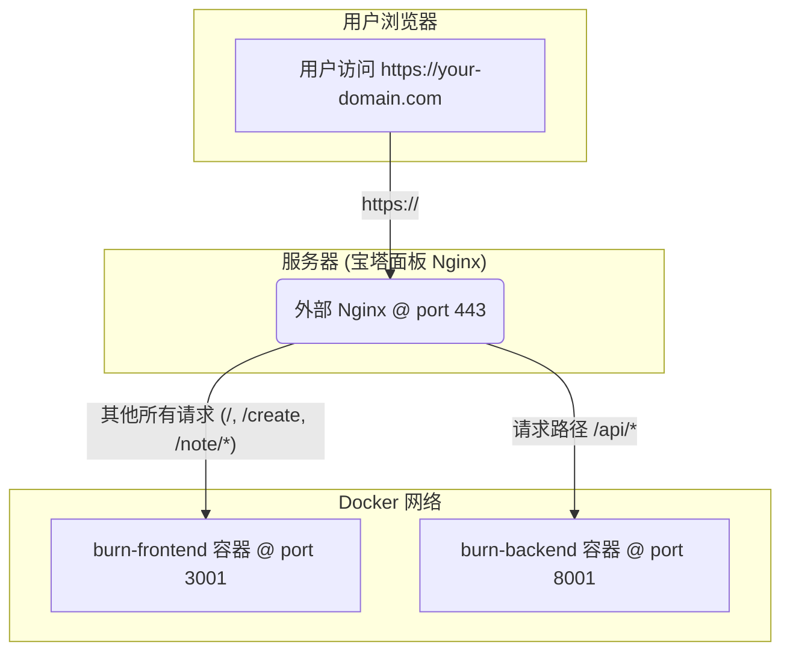

# 设计文档

本文档记录了 "Burn After Reading" 应用的核心系统设计、架构决策和技术选型。

## 1. 生产环境架构

本应用采用基于 Docker Compose 的容器化架构，并通过一个外部 Nginx 服务作为反向代理进行流量分发和 SSL 终止。这种设计实现了前后端的解耦，并简化了部署和扩展。

### 1.1 核心组件

-   **`burn-backend`**: FastAPI 后端服务，运行在 Docker 容器中，处理所有业务逻辑。
-   **`burn-frontend`**: Vue.js 单页应用，编译为静态文件后，由一个专用的 Nginx 容器提供服务。
-   **外部 Nginx (宝塔面板)**: 作为整个应用的流量入口，负责：
    -   处理 HTTPS 请求和 SSL 证书。
    -   作为反向代理，根据 URL 路径将请求智能路由到后端或前端容器。

### 1.2 流量走向图

下图清晰地展示了用户请求在系统中的完整处理流程：

---

## 2. 数据库设计 (v2)

*此处可添加数据库 ER 图或对 `src/models.py` 中核心模型的详细说明。*

## 3. API 设计

*API 的设计遵循 RESTful 原则。完整的、可交互的 API 文档由 FastAPI 自动生成，可通过以下路径在本地开发环境访问：*

-   **Swagger UI**: `http://127.0.0.1:8000/docs`
-   **ReDoc**: `http://127.0.0.1:8000/redoc` 